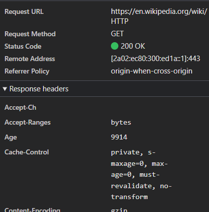
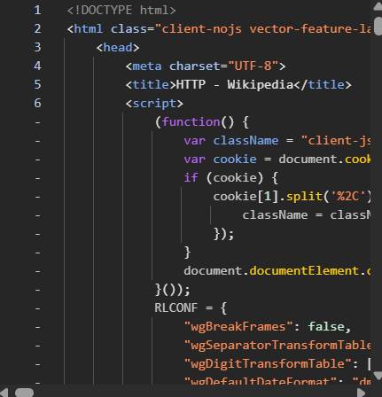
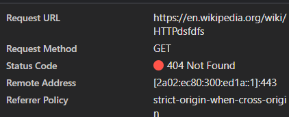
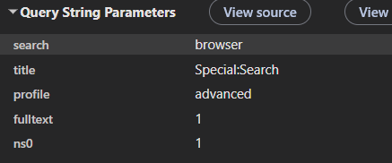
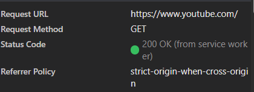

# Лабораторная работа №1. HTTP

## Цель работы

Понять, что происходит, когда пользователь открывает сайт.
Научиться находить и анализировать HTTP-запросы в браузере.
Разобраться в назначении методов GET, POST, PUT, DELETE.

## Ход работы:

**1.Анализ запроса к странице Wikipedia**
Был выполнен переход по адресу:
[https://en.wikipedia.org/wiki/HTTP]

URL: [https://en.wikipedia.org/wiki/HTTP]

1.1 Используется метод GET. GET применяется потому, что браузер только запрашивает (получает) представление ресурса — HTML-страницу статьи — и не изменяет никаких данных на сервере. GET — безопасный (safe) и идемпотентный метод: повторные одинаковые запросы не имеют побочных эффектов и возвращают тот же результат, что идеально подходит для чтения содержимого сайта.

1.2 Статус: 200 OK. Это означает, что запрос успешно обработан сервером и в теле ответа возвращено запрошенное содержимое (HTML-документ статьи) 

1.3 (Response Headers) содержат метаданные о том, что и как сервер отправил: тип и кодировку содержимого, правила кэширования, настройки безопасности, размер данных.

1.4 В теле ответа содержится HTML-код страницы.

1.5 Помимо основного HTML-документа, браузер отправляет ещё множество запросов, которые видны в панели Network при обновлении страницы:

CSS-файлы

JavaScript-файлы

Изображения (тип «img»/«image»)

Шрифты (тип «font»)

1.6
**Анализ запроса к несуществующей странице**\

Был выполнен переход по адресу:

[https://en.wikipedia.org/wiki/HTTPdsfdfs]

Статус: 404 Not Found
Код 404 означает, что запрашиваемый ресурс отсутствует на сервере.

# 2.Анализ HTTP-запросов.

 Метод: GET
В URL передаются параметры:

•	search=browser

•	title=Special:Search

Query Parameters используются для передачи данных через строку запроса.

# 3.Анализ HTTP-запросов

Был проанализирован сайт (https://www.youtube.com).

*Метод:* GET

*Статус:* 200 OK

При загрузке страницы дополнительно отправляются запросы к CSS, JavaScript и изображениям для корректного отображения сайта.

# 4.Составление HTTP-запросов

**GET-запрос**

GET / HTTP/1.1

Host: sandbox.usm.com

User-Agent: Ciolac Dmitri

*User-Agent - это заголовок, содержащий информацию о клиенте (браузере или приложении).*

**POST-запрос**

POST /cars HTTP/1.1

Host: sandbox.usm.com/cars

Content-Type: application/x-www-form-urlencoded

make=Toyota&model=Corolla&year=2020

*Метод POST используется для отправки данных и создания ресурса.*

**PUT-запрос**

PUT /cars/1 HTTP/1.1

Host: sandbox.usm.com

User-Agent: Ciolac Dmitri

Content-Type: application/json

{
"make": "Toyota",
"model": "Corolla",
"year": 2021
}

*PUT используется для полного обновления ресурса.*

**Разница между PUT и PATCH**

*PUT обновляет весь ресурс полностью.*

*PATCH обновляет только переданные поля.*

